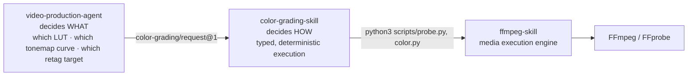
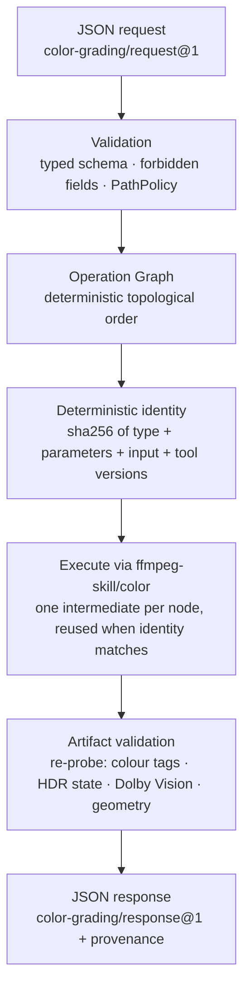

<p align="center">
  
</p>

<h1 align="center">color-grading-skill</h1>

<p align="center"><strong>Deterministic colour grading execution for AI video agents.</strong></p>

<p align="center">
  Typed operations · Validated artifacts · Full provenance<br>
  Part of the AI Video Production Ecosystem · built on <a href="https://github.com/kajisho5/ffmpeg-skill">ffmpeg-skill</a>
</p>

<p align="center">
  <a href="https://github.com/kajisho5/color-grading-skill/actions/workflows/tests.yml"></a>
  
  
  <a href="LICENSE"></a>
</p>

```bash
git clone https://github.com/kajisho5/color-grading-skill && cd color-grading-skill && pip install -e .
```

`color-grading-skill` executes colour operations that an AI agent has already decided on — HDR → SDR tone mapping,
3D LUT application, colour-tag retagging, Dolby Vision RPU removal — as a typed, deterministic operation graph on
top of [ffmpeg-skill](https://github.com/kajisho5/ffmpeg-skill), with every output re-probed and validated and every
result carrying full provenance.

**It does not decide anything.** No LLM, no prompt, no reasoning, no automatic LUT or "look" selection, no judging
whether a frame looks cinematic. It takes a typed request, executes exactly what it says, refuses everything else,
and reports what it observed.

---

**Contents**
[What it does](#what-it-is-and-what-it-is-not) · [Quick start](#quick-start) · [How it works](#how-it-works) ·
[Supported operations](#supported-operations) · [Deterministic execution](#deterministic-execution) ·
[Artifact validation](#artifact-validation) · [Provenance](#provenance) · [Security](#security) ·
[Built for agents](#built-for-agents) · [Errors](#error-handling) · [Limitations](#current-limitations) ·
[Testing](#testing) · [Docs](#docs) · [Ecosystem](#relationship-to-the-other-skills) · [Support](#support)

---

## What it is, and what it is not

| | |
|---|---|
| **Does** | execute `HDR_TO_SDR`, `LUT_APPLY`, `RETAG`, `STRIP_DOVI`, `PRIMARY_CORRECTION` as a dependency graph; validate every artifact by re-probing it (measured colour tags, never assumed); reuse intermediates by content-addressed identity; record full provenance |
| **Does not** | decide *which* colour treatment, LUT, tonemap curve or correction values to apply; look at a frame and judge it "cinematic"; perform gamma, lift, gain, levels or curves correction (see [Limitations](#current-limitations)); convert containers; run `ffmpeg` directly; accept a command, argv or filter string from the caller |

That split is the whole design: **[video-production-agent](https://github.com/kajisho5/video-production-agent)**
decides *what* to do and builds the request; **color-grading-skill** decides *how* to execute it safely and
deterministically; **[ffmpeg-skill](https://github.com/kajisho5/ffmpeg-skill)** is the media execution engine that
actually runs FFmpeg. Full boundary, including how this differs from `media-analysis-skill`'s pure measurement role:
[docs/architecture.md](docs/architecture.md).

## Quick start

Requirements: Python 3.9+ (standard library only), an
[ffmpeg-skill](https://github.com/kajisho5/ffmpeg-skill) checkout (0.9.2 ≤ version < 1.0, for `PRIMARY_CORRECTION`'s
`--correct`), and `ffmpeg` / `ffprobe` on `PATH` for ffmpeg-skill itself.

```bash
# 1. install this skill
pip install -e .

# 2. check the machine: ffmpeg-skill, ffmpeg/ffprobe, and every capability the five operations need
color-grading doctor --json --ffmpeg-skill /path/to/ffmpeg-skill

# 3. read the machine-readable contract (for agent frameworks)
color-grading skill --json | head -40
```

Write a request naming the operation graph — here, HDR tone mapping followed by a LUT:

```json
{
  "schema": "color-grading/request@1",
  "project": {
    "project_id": "grade-42",
    "source": {"source_id": "raw", "path": "footage/iphone_hdr.mov"},
    "operations": [
      {"op_id": "sdr", "type": "HDR_TO_SDR", "input": "source", "parameters": {"tonemap": "hable"}},
      {"op_id": "grade", "type": "LUT_APPLY", "input": "op:sdr", "parameters": {"lut_path": "luts/look_a.cube"}}
    ],
    "outputs": [{"output_id": "graded", "operation": "op:grade", "path": "deliver/grade-42.mov", "format": "mov"}]
  }
}
```

Then plan (read-only) and run it:

```bash
color-grading plan request.json --json     # graph, tool selection, expected geometry — writes no media
color-grading run request.json --json      # execute; stdout: exactly one color-grading/response@1 document
```

`ok: true` and `outputs[0].status: "completed"` mean the artifact exists at `deliver/grade-42.mov`, was re-probed,
and matched what `HDR_TO_SDR` and `LUT_APPLY` are each supposed to have measurably done. Full request/response
schema: [docs/architecture.md](docs/architecture.md); the plain-language contract an agent reads: [SKILL.md](SKILL.md).

## How it works





Nothing in this pipeline reasons about the image. Every box is a typed, mechanical step; the only judgement call
(which operation, which LUT, which curve) already happened upstream, in the request this skill receives.

## Supported operations

| Operation | Purpose |
|---|---|
| `HDR_TO_SDR` | HDR (PQ/HLG, BT.2020) → SDR BT.709 tone mapping with an explicit curve |
| `LUT_APPLY` | Apply a 3D `.cube` LUT |
| `RETAG` | Rewrite colour tags (BT.709 / BT.2020 PQ / BT.2020 HLG / BT.601) without a re-encode where possible |
| `STRIP_DOVI` | Remove a Dolby Vision RPU (HEVC only) |
| `PRIMARY_CORRECTION` | Typed primary colour correction: exposure, contrast, saturation, white balance (temperature + tint) — each an explicit, independently optional, range-checked parameter |

Each maps 1:1 onto one mode of `ffmpeg-skill/color`; every operation takes exactly one input and none of them
change duration or frame geometry (verified against the source within a documented tolerance). Full parameter
tables, defaults, ranges and the exact ffmpeg-skill flags behind each one: [docs/architecture.md](docs/architecture.md)
and [docs/ffmpeg-skill.md](docs/ffmpeg-skill.md).

Output containers (`mp4`, `mov`, `m4v`, `mkv`) must match the source's — this skill does not convert containers
(use ffmpeg-skill/export for that).

## Deterministic execution

Every operation gets an identity — `sha256` over canonical JSON of `{type, effective parameters, input identity,
tool versions}` — computed before anything runs. Two things follow from that:

- **Reuse.** Re-running the same request with the same inputs and the same ffmpeg-skill/FFmpeg versions reuses every
  matching intermediate instead of re-encoding. A tampered or truncated intermediate is detected (size + `sha256`
  re-checked against the manifest) and re-processed, never falsely trusted.
- **Content-addressed LUTs.** `LUT_APPLY`'s identity uses the LUT file's own `sha256`, never its path: a LUT moved to
  a new location keeps its identity; a LUT edited in place at the same path gets a new one. A LUT is data, resolved
  through its own path policy and hashed — never a filter string.

No timestamps, no UUIDs, stable topological order. Identical request + identical inputs + identical tool versions
→ identical `plan_id` and operation ids, every time. Design rationale: [docs/decisions.md](docs/decisions.md).

## Artifact validation

This skill does not trust a `0` exit code from ffmpeg-skill as proof that an operation worked. Every artifact is
re-probed and checked: exists, size > 0, readable, has a video stream, duration and resolution unchanged from the
source — plus the operation's own measurable effect:

| Operation | What is verified on the output |
|---|---|
| `HDR_TO_SDR` | no longer reports `hdr: true` |
| `LUT_APPLY` | `pix_fmt == yuv420p` |
| `RETAG` | the exact `(color_space, color_primaries, color_transfer)` triple requested |
| `STRIP_DOVI` | no Dolby Vision side data present |
| `PRIMARY_CORRECTION` | no fixed target state (a continuous correction, not a discrete tag); the generic checks above plus ffmpeg-skill's own before/after `measurements` (real signalstats numbers — luminance and saturation averages — never a subjective judgement) |

This caught a real ffmpeg-skill/FFmpeg limitation during development: a stream-copy retag can exit `0` without
actually rewriting colour tags already baked into a source's bitstream. This skill reports that as
`VALIDATION_ERROR`, never a false success — see [docs/ffmpeg-skill.md](docs/ffmpeg-skill.md) for the measured case.

## Provenance

Every result carries what it did, not just that it succeeded: `operation_id`, `type`, `tool`, `tool_versions`,
`input_hash`, `output_hash`, the LUT's own hash (for `LUT_APPLY`), `measurements`, and `tool_commands_observed` (the
commands ffmpeg-skill itself reports having run, not a description this skill reconstructs afterwards). Every
output carries the full operation chain back to the source, each link with its own hash and status. Measured colour
metadata is always *observed* (read back from `ffmpeg-skill/probe`), never inferred from the request.

## Security

- No shell, no `eval`, no user-supplied command, argv, executable, script or filter string — those field names are
  rejected anywhere in the request document, at any nesting depth; unknown fields are rejected everywhere.
- Every value that reaches a subprocess argv is a fixed flag, a number formatted by this skill, an enum already
  validated against the schema, or a resolved absolute path — never a raw string from the request.
- A LUT is resolved through its own path policy, separate from the video input's (a caller allowed to read footage
  under `/footage` cannot thereby name any file on the machine as a LUT), checked for a `.cube` extension and a size
  ceiling, and hashed — never parsed or treated as a filter string.
- Inputs and LUTs must be regular files (symlinks resolved before every check); outputs must resolve inside the
  workspace — no `..`, no symlinked escape, no reserved Windows device names — and may never be an existing input
  file unless `overwrite: true` is explicit.
- Only `ffmpeg-skill/probe` and `ffmpeg-skill/color` can ever be started, from a checkout named by the caller, never
  by the request document, with a minimal child environment.

Full enforcement table, including what is deliberately *not* enforced (e.g. no root restriction by default, matching
the rest of the ecosystem): [docs/security.md](docs/security.md).

## Built for agents

### Machine-readable contract

```bash
color-grading skill --json      # color-grading/contract@1: operations, parameters, capabilities, errors, schemas
color-grading doctor --json     # color-grading/doctor@1: environment vs. contract, per-capability status
```

The contract states stable identifiers (`skill_id`, `operations[].type`, `operations[].parameters`,
`unsupported_operations`, `output_formats`, `errors.codes`), all derived from the tables the code runs on — there
are no placeholder operations. `doctor` reports every capability (`ffmpeg-skill`, `ffmpeg`, `ffprobe`,
`filter:<name>`, `encoder:<name>`, `bsf:<name>`) as `supported`, `unsupported` or `unknown` — an installed capability
is never reported absent, and a failed detection is never silently read as a pass.

### CLI

| command | reads media | writes media |
|---|---|---|
| `skill --json` / `contract --json` | no | no |
| `doctor --json [--ffmpeg-skill DIR]` | no | no |
| `validate REQUEST\|- --json` | no | no |
| `plan REQUEST\|- --json` | probes source + hashes LUTs (read-only) | no |
| `run REQUEST\|- --json [--dry-run] [--workspace DIR] [--allowed-input ROOT] [--allowed-lut ROOT]` | yes | yes |

`stdout` under `--json` is always exactly one document, on success and failure alike; `stderr` carries diagnostics.
Exit codes are stable per error code (see [Error handling](#error-handling) below); every command supports `--help`
for its full flag list.

### ffmpeg-skill integration

This skill never calls `ffmpeg` or `ffprobe` itself. Every process it starts is
`python3 <ffmpeg-skill>/scripts/{probe,color}.py` with a typed argv, verified against ffmpeg-skill's own
machine-readable contract (`contract_version 1.0`) before use — flags this skill emits are checked against the live
contract by `doctor`, and a version outside `[0.9.1, 1.0.0)` is refused rather than assumed to behave the same.
Exact tools, flags and every measured compatibility gap: [docs/ffmpeg-skill.md](docs/ffmpeg-skill.md).

## Error handling

| code | when |
|---|---|
| `INVALID_REQUEST` | document shape, unknown/forbidden field, bad type, enum or range |
| `INVALID_INPUT` | source missing, not a regular file, unreadable, no video stream, LUT missing/empty/oversized |
| `PATH_NOT_ALLOWED` | outside allowed roots/workspace, traversal, symlink escape, unsafe name |
| `UNSUPPORTED_OPERATION` | not implemented (declared or unknown type) |
| `UNSUPPORTED_FORMAT` | output format unknown, extension mismatch, container ≠ source, LUT not `.cube` |
| `DEPENDENCY_ERROR` | duplicate id, cycle, self-reference, unreachable node |
| `MISSING_INPUT` | reference to an undeclared operation |
| `OUTPUT_ERROR` | output exists, collides with the input, empty, could not be written |
| `VALIDATION_ERROR` | artifact failed post-validation (stream, duration, resolution, colour tags, pix_fmt) |
| `TOOL_ERROR` | ffmpeg-skill missing/incompatible, tool failure, timeout (retryable) |
| `CANCELLED` | SIGINT/SIGTERM (retryable) |
| `INTERNAL_ERROR` | a bug in this skill — still exactly one JSON document |

Every code has a stable exit code (`errors.exit_codes` in the contract); `ok` mirrors the process exit code.

## Current limitations

Stated as boundary, not as bugs to be worked around with a private filter string:

- **Gamma, lift, gain, levels and curves are not implemented**: `WHITE_BALANCE` (as its own operation type — use
  `PRIMARY_CORRECTION`'s `temperature`/`tint` instead), `GAMMA`, `LIFT`, `GAIN`, `LEVELS`, `CURVES` are declared in
  the contract's `unsupported_operations` and rejected with `UNSUPPORTED_OPERATION` — ffmpeg-skill's public contract
  has no typed filter for any of them yet. This skill will not grow a private one; it will support these once
  ffmpeg-skill (or a future typed capability) does. Details per operation: [docs/ffmpeg-skill.md](docs/ffmpeg-skill.md).
- One source per request; no MIX/CONCAT analogue for colour.
- No container/format conversion — output keeps the source's container.
- A chain of N operations costs N re-encodes/stream-copies (ffmpeg-skill/color's mode flags are mutually exclusive).
- `LUT_APPLY`'s `lut_strength` of exactly `0.0` behaves like `1.0` (full LUT) — ffmpeg-skill's own documented
  behaviour, not something this skill introduces or can fix on its own.
- No cache eviction: `<workspace>/.color-grading/<project_id>/` grows until the caller removes it.

## Testing

```bash
pip install -e . pytest
export COLOR_GRADING_FFMPEG_SKILL_DIR=/path/to/ffmpeg-skill     # or clone it as ../ffmpeg-skill
python -m pytest -q
```

185 tests, nothing skipped by default, nothing mocked in the integration layer: 102 unit (schema, graph, path
policy, determinism), 49 security (injection, path/symlink escapes, argv audit), 5 contract (contract ⇔
implementation, doctor), and 29 integration tests that run every operation against real video through a real
ffmpeg-skill checkout and real FFmpeg — including deterministic pixel-level checks for `LUT_APPLY` and
`PRIMARY_CORRECTION`, `PRIMARY_CORRECTION`'s observed before/after `measurements`, and a reproduction of the
exit-0-but-unchanged retag case above. CI (`.github/workflows/tests.yml`) runs Linux (Python 3.9, 3.11), Windows and
macOS, each against a real FFmpeg install and a pinned ffmpeg-skill checkout. File-by-file coverage and what
real-media verification does and does not prove: [docs/testing.md](docs/testing.md).

## Docs

| | |
|---|---|
| [SKILL.md](SKILL.md) | what the calling agent reads: contract, rules, and how to read the response |
| [docs/architecture.md](docs/architecture.md) | full request/response schema, operation graph, identity, execution pipeline |
| [docs/decisions.md](docs/decisions.md) | design decisions (ADRs) and the reasoning behind them |
| [docs/ffmpeg-skill.md](docs/ffmpeg-skill.md) | exact tools/flags used, version compatibility, every measured gap |
| [docs/security.md](docs/security.md) | full enforcement table: what is and is not defended against |
| [docs/testing.md](docs/testing.md) | file-by-file test coverage, fixture construction |

## Relationship to the other skills

| | [ffmpeg-skill](https://github.com/kajisho5/ffmpeg-skill) | [media-analysis-skill](https://github.com/kajisho5/media-analysis-skill) | **color-grading-skill** | [video-production-agent](https://github.com/kajisho5/video-production-agent) |
|---|---|---|---|---|
| Role | media execution engine (hands) | measurement / observation (meters) | **colour grading execution** | reasoning / decision / orchestration (brain) |
| Never | holds a project model | edits or writes media | decides which LUT/curve/correction values, performs gamma/lift/gain/levels/curves correction, converts containers, runs ffmpeg directly | runs ffmpeg |

`audio-production-skill`, `video-editing-skill`, `transcription-skill`, `subtitle-skill` and QC are not touched by
this skill — it has no audio, cut/trim, speech or final-QC role.

## Support

If this skill saves you time, you can help keep it maintained through [GitHub Sponsors](https://github.com/sponsors/kajisho5).
Issues and pull requests are just as welcome.

## License

[MIT](LICENSE)
